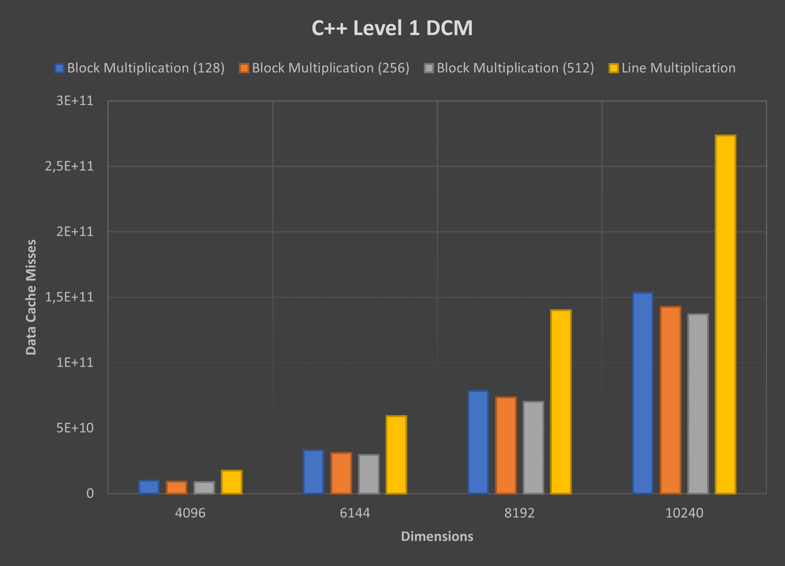

# **Performance evaluation of a single core**

The proposed project aims to show the effect on the processor performance of the memory hierarchy when accessing large amounts of data.

## **Index**
- **[Problem description and algorithms explanation](#problem-description-and-algorithms-explanation)**
- **[Performance metrics](#performance-metrics)**
- **[Results and analysis](#results-and-analysis)**
- **[Conclusions](#conclusions)**

## **Problem description and algorithms explanation**

For this study we will approach the problem, **product of two matrices** in different ways (*explained bellow*).

### **1. Basic Multiplication**

The basic multiplication algorithm is a linear algebra operation that produces a matrix C from two others A and B.

It applies a row-by-column multiplication, where the entries in the *ith row* of A are multiplied by the corresponding entries in the *jth column* of B and then adding the results. 

**PseudoCode:**
```py
for line_i in matrix_a:
    for col_j in matrix_b:
        for elem in line_i:
            matrix_c[i][j] = elem * col_j
```

### **2. Line Multiplication**

The line multiplication is a variation of the basic multiplication, where the entries in the *ith row* of A are multiplied by the corresponding entries in the *jth row* of B and thus accumulated in the respective position of the matrix C.

**PseudoCode:**
```py
for line_i in matrix_a:
    for elem in line_i:
        for line_j in matrix_b:
            matrix_c[i][j] = elem * line_j
```

### **3. Block Multiplication**

The block multiplication is a block oriented algorithm that divides the matrices A and B in blocks and takes advantage of the line multiplication for the calculations of the values, of the matrix C.

**PseudoCode:**
```py
for block_row in range(0, size_a, block_size):
    for k in range(0, size_a, block_size):
        for block_col in range(0, size_b, block_size):
            matrix_c[block_row][block_col] += OnMultLine(matrix_a[block_row][k], matrix_b[k][block_col])
```

## **Performance metrics**

In order to measure the performance of the processor in the given problem, we decided to compare the results using two different programming languages, and some relevant performance indicators.

The central programming language studied is **C++**, supported by the Performance API (**PAPI**) to collect the values of **data cache misses** in the Level 1 and Level 2 caches.

As for our second programming language we opted for **python**, measuring and comparing the **time performance** against **C++**.

So that our study is more consistent, we decided to take a considerable number of **samples**, 5 for "quick" runs, and 3 for "longer" ones. As well as, making use of **different sized** matrixes as stated by the given proposal.

## **Results and analysis**

### **1. Basic Multiplication**

**C++ Performance:**

<table align="center">
  <tbody>
    <tr>
      <td>
        <table>
          <thead>
          <tr>
          <th>Size</th>
          <th>Time(s)</th>
          <th>Level 1 DCM</th>
          <th>Level 2 DCM</th>
          </tr>
          </thead>
          <tbody>
          <tr>
          <td>600</td>
          <td>0.1974</td>
          <td>244785701</td>
          <td>39485267</td>
          </tr>
          <tr>
          <td>1000</td>
          <td>1.2900</td>
          <td>1226948406</td>
          <td>259755344</td>
          </tr>
          <tr>
          <td>1400</td>
          <td>3.5128</td>
          <td>3515137318</td>
          <td>1322263105</td>
          </tr>
          <tr>
          <td>1800</td>
          <td>18.2572</td>
          <td>9081694573</td>
          <td>7534199569</td>
          </tr>
          <tr>
          <td>2200</td>
          <td>38.8636</td>
          <td>17648912428</td>
          <td>23211642005</td>
          </tr>
          <tr>
          <td>2600</td>
          <td>69.1080</td>
          <td>30902867592</td>
          <td>51364020207</td>
          </tr>
          <tr>
          <td>3000</td>
          <td>115.1938</td>
          <td>50302210624</td>
          <td>95153348353</td>
          </tr>
          </tbody>
        </table>
      </td>
      <td>
        <div style="padding-top: 30px;">
          
          <p align="center" style="font-size: 11px">
            <b><i>Fig 1. C++ Basic Multiplication DCM</i></b>
          </p>
        </div>
      </td>
    </tr>
  </tbody>
</table>

From the analysis of the table values we verify an expected increase in the elapsed time on bigger matrix sizes. As for the data cache misses we can follow the same conclusions, knowing that the bigger the matrix is the more memory accesses occur.

**Python Performance:**

<table align="center">
  <tbody>
    <tr>
      <td>
        <table>
          <thead>
          <tr>
          <th>Size</th>
          <th>Time(s)</th>
          </tr>
          </thead>
          <tbody>
          <tr>
          <td>600</td>
          <td>14.7924</td>
          </tr>
          <tr>
          <td>1000</td>
          <td>87.9724</td>
          </tr>
          <tr>
          <td>1400</td>
          <td>254.0206</td>
          </tr>
          </tbody>
        </table>
      </td>
      <td>
        <table>
          <thead>
          <tr>
          <th>Size</th>
          <th>Time(s)</th>
          </tr>
          </thead>
          <tbody>
          <tr>
          <td>1800</td>
          <td>552.8929</td>
          </tr>
          <tr>
          <td>2200</td>
          <td>1048.3686</td>
          </tr>
          <tr>
          <td>2600</td>
          <td>Time Limit</td>
          </tr>
          </tbody>
        </table>
      </td>
    </tr>
  </tbody>
</table>


As in the previous analysis, as the matrix size increases we verify a notorious increase in the algorithm's elapsed time.

### **2. Line Multiplication**

**C++ Performance:**

<table align="center">
  <tbody>
    <tr>
      <td>
        <table>
          <thead>
          <tr>
          <th>Size</th>
          <th>Time(s)</th>
          <th>Level 1 DCM</th>
          <th>Level 2 DCM</th>
          </tr>
          </thead>
          <tbody>
          <tr>
          <td>600</td>
          <td>0.1066</td>
          <td>27099162</td>
          <td>57536539</td>
          </tr>
          <tr>
          <td>1000</td>
          <td>0.4912</td>
          <td>125836635</td>
          <td>264804441</td>
          </tr>
          <tr>
          <td>1400</td>
          <td>1.7010</td>
          <td>346408203</td>
          <td>693423581</td>
          </tr>
          <tr>
          <td>1800</td>
          <td>3.6562</td>
          <td>745937934</td>
          <td>1424375689</td>
          </tr>
          <tr>
          <td>2200</td>
          <td>6.5332</td>
          <td>2074927662</td>
          <td>2562864250</td>
          </tr>
          <tr>
          <td>2600</td>
          <td>10.5584</td>
          <td>4413086703</td>
          <td>4189022075</td>
          </tr>
          <tr>
          <td>3000</td>
          <td>15.9574</td>
          <td>6780680802</td>
          <td>6378165232</td>
          </tr>
          </tbody>
        </table>
      </td>
      <td>
        <div style="padding-top: 30px;">
          
          <p align="center" style="font-size: 11px">
            <b><i>Fig 2. C++ Line Multiplication DCM</i></b>
          </p>
        </div>
      </td>
      </td>
    </tr>
  </tbody>
</table>

<table>
  <thead>
  <tr>
  <th>Size</th>
  <th>Time(s)</th>
  <th>Level 1 DCM</th>
  <th>Level 2 DCM</th>
  </tr>
  </thead>
  <tbody>
  <tr>
  <td>4096</td>
  <td>43.3510</td>
  <td>17532306353</td>
  <td>1606236906</td>
  </tr>
  <tr>
  <td>6144</td>
  <td>144.2100</td>
  <td>59125392006</td>
  <td>54497490331</td>
  </tr>
  <tr>
  <td>8192</td>
  <td>341.1400</td>
  <td>1.40058E+11</td>
  <td>1.31568E+11</td>
  </tr>
  <tr>
  <td>10240</td>
  <td>675.5400</td>
  <td>2.73433E+11</td>
  <td>2.72578E+11</td>
  </tr>
  </tbody>
</table>


There is a clear improvement in all performance metrics comparing the **basic multiplication** with **line multiplication**. This is due to the fact that the second algorithm takes advantage of the **C++** memory allocation.

When accessing a specific matrix position the compiler reads not only the value of that position, as well as the whole block where the value is inserted.

Having that in mind, trying to decrease memory accesses to disk (since it is a time costly operation), the **line multiplication** algorithm makes an effort to make use of all the elements read from the memory block.

**Python Performance:**

<table align="center">
  <tbody>
    <tr>
    <td>
      <table align="center">
        <thead>
        <tr>
        <th>Size</th>
        <th>Time(s)</th>
        </tr>
        </thead>
        <tbody>
        <tr>
        <td>600</td>
        <td>13.8822</td>
        </tr>
        <tr>
        <td>1000</td>
        <td>65.2808</td>
        </tr>
        <tr>
        <td>1400</td>
        <td>180.7721</td>
        </tr>
        </tbody>
      </table>
    </td>
    <td>
      <table align="center">
        <thead>
        <tr>
        <th>Size</th>
        <th>Time(s)</th>
        </tr>
        </thead>
        <tbody>
        <tr>
        <td>1800</td>
        <td>385.8744</td>
        </tr>
        <tr>
        <td>2200</td>
        <td>704.9206</td>
        </tr>
        <tr>
        <td>2600</td>
        <td>Time Limit</td>
        </tr>
        </tbody>
      </table>
    </td>
  </tr>
  </tbody>
</table>

Being a high level language **python** code does the heavy lifting in a low-level language like **C/C++**, in this degree, an improvement in the **C++** performance would imply an improvement in the **python** program execution, which was corroborated by the achieved values.

### **C++ vs Python:**

<table align="center">
  <tbody>
  <tr>
    <td>
      <div>
        <p align="center" justify="center">
          
        </p>
        <p align="center" style="font-size: 11px">
          <b><i>Fig 3. C++ Time Performance</i></b>
        </p>
      </div>
    </td>
    <td>
    <div>
        <p align="center" justify="center">
          
        </p>
        <p align="center" style="font-size: 11px">
          <b><i>Fig 4. Python Time Performance</i></b>
        </p>
      </div>
    </td>
  </tr>
  </tbody>
</table>

From the graphs above, and the results obtained with different runs, we can conclude that **python** has a worst performance in comparison to **C++** regarding the given problem.

The reason for such differences can be explained by the fact that **python** uses the interpreter and performs lots of run time operations while **C++** programs are precompiled, thus only executing the produced program. Furthermore, no libraries were used in the development of the algorithms from which **python** would have greater benefits.

### **3. Block Multiplication**

**C++ Performance:**

<table align="center" style="width: 480px">
  <thead>
  <tr>
  <th>Block Size = 128</th>
  <th>Size</th>
  <th>Time(s)</th>
  <th>Level 1 DCM</th>
  <th>Level 2 DCM</th>
  </tr>
  </thead>
  <tbody>
  <tr>
  <td>
  <td>4096</td>
  <td>36.6276</td>
  <td>9832748918</td>
  <td>32935278304</td>
  </tr>
  <tr>
  <td>
  <td>6144</td>
  <td>129.4356</td>
  <td>33176432529</td>
  <td>1.12414E+11</td>
  </tr>
  <tr>
  <td>
  <td>8192</td>
  <td>303.9380</td>
  <td>78627735611</td>
  <td>2.65393E+11</td>
  </tr>
  <tr>
  <td>
  <td>10240</td>
  <td>622.3020</td>
  <td>1.53525E+11</td>
  <td>5.16219E+11</td>
  </tr>
  </tbody>
</table>

<table align="center" style="width: 480px">
  <thead>
  <tr>
  <th>Block Size = 256</th>
  <th>Size</th>
  <th>Time(s)</th>
  <th>Level 1 DCM</th>
  <th>Level 2 DCM</th>
  </tr>
  </thead>
  <tbody>
  <tr>
  <td>
  <td>4096</td>
  <td>34.5753</td>
  <td>9133260397</td>
  <td>23278123986</td>
  </tr>
  <tr>
  <td>
  <td>6144</td>
  <td>118.8180</td>
  <td>30815161405</td>
  <td>76811797988</td>
  </tr>
  <tr>
  <td>
  <td>8192</td>
  <td>405.4706</td>
  <td>73352067948</td>
  <td>1.62399E+11</td>
  </tr>
  <tr>
  <td>
  <td>10240</td>
  <td>561.1250</td>
  <td>1.42613E+11</td>
  <td>3.50658E+11</td>
  </tr>
  </tbody>
</table>

<table align="center" style="width: 480px">
  <thead>
  <tr>
  <th>Block Size = 512</th>
  <th>Size</th>
  <th>Time(s)</th>
  <th>Level 1 DCM</th>
  <th>Level 2 DCM</th>
  </tr>
  </thead>
  <tbody>
  <tr>
  <td>
  <td>4096</td>
  <td>36.4226</td>
  <td>8758854262</td>
  <td>19290855969</td>
  </tr>
  <tr>
  <td>
  <td>6144</td>
  <td>76.8863</td>
  <td>29606575477</td>
  <td>66240145866</td>
  </tr>
  <tr>
  <td>
  <td>8192</td>
  <td>341.0196</td>
  <td>70239707870</td>
  <td>1.36267E+11</td>
  </tr>
  <tr>
  <td>
  <td>10240</td>
  <td>512.3696</td>
  <td>1.36869E+11</td>
  <td>3.06304E+11</td>
  </tr>
  </tbody>
</table>

<p align="center" justify="center">
  
</p>
<p align="center" style="font-size: 11px">
  <b><i>Fig 5. C++ Algorithm Time Comparison</i></b>
</p>

<table align="center">
  <tbody>
  <tr>
    <td>
      <div>
        <p align="center" justify="center">
          
        </p>
        <p align="center" style="font-size: 11px">
          <b><i>Fig 6. C++ Level 1 DCM</i></b>
        </p>
      </div>
    </td>
    <td>
    <div>
        <p align="center" justify="center">
          
        </p>
        <p align="center" style="font-size: 11px">
          <b><i>Fig 7. C++ Level 2 DCM</i></b>
        </p>
      </div>
    </td>
  </tr>
  </tbody>
</table>

Since the memory is divided into consecutive blocks each access to memory reads one block at a time. When dealing with large amounts of data, trying to reduce these accesses becomes essencial for a better performance program.

To this extent, the **block algorithm** takes advantage of the memory layout by reducing memory calls (divides the problem into smaller ones) in contrast to the **line multiplication algorithm**, which results in a data cache miss reduction.

Increasing the block size leads to a greater performance, capped by the Level 1 cache block size, since it is the smaller of the various caches. By analysing the values in each of the tables, we can conclude the stated above.

### **4. Floating Point Operations Comparison**

<table align="center">
  <tbody>
  <tr>
    <td>
      <div>
        <p align="center" justify="center">
          
        </p>
        <p align="center" style="font-size: 11px">
          <b><i>Fig 8. C++ Number of Floating Point Operations Comparison</i></b>
        </p>
      </div>
    </td>
    <td>
    <div>
        <p align="center" justify="center">
          
        </p>
        <p align="center" style="font-size: 11px">
          <b><i>Fig 9. C++ Number of Floating Point Operations Comparison</i></b>
        </p>
      </div>
    </td>
  </tr>
  </tbody>
</table>

Concerning the number of floating point operations per second (useful work), the algorithms which perform better (higher values) are the ones who present superior time performances, as seen previously.

As a consequence of bad memory use, much of the work done by the processor revolves around memory accesses and cache coherence, decreasing, this way, the useful work.

Comparing the 3 algorithm versions, in order, and as the size of the matrixes increase, there is a significant decrease in the number of operatins per second, for the first algorithm, due to the fact that for each calculation there is a need for extra load/store operations. Contrastingly, for the second and third variants, for each useful operation, as there is an improved memory cache reuse, the number of load/store operations is much lower, therefore substantially better results. 

## **Conclusions**

To sum up, this study allowed us to perceive other important metrics when taking program performance into account, not only the time complexity, since each variation of the matrix multiplication has the same Big O, but the way we take advantage of memory layout and locality.